# Project Story Doc

[](https://github.com/layinginbed/project-story-doc/actions/workflows/validate.yml)
[](https://learn.chatgpt.com/docs/build-skills)
[](#project-status)

**A source-grounded Codex Skill for creating and maintaining trustworthy explanations of projects, repositories, papers, and paper-plus-code artifacts.**

[简体中文](README.zh-CN.md) · [Install](#install) · [How it works](#how-it-works) · [Contributing](CONTRIBUTING.md)

Project Story Doc is built for a hard documentation problem: keeping a reader's mental model aligned with what an artifact actually does now.

It does more than summarize files. It freezes a source snapshot, separates implementation from plans and inference, traces representative behavior, checks structural and state coverage, and maintains a small current document set over time.

## Why this exists

Technical documentation often fails in predictable ways:

- it describes design intent as if it were running behavior;
- it turns a repository tree into a narrative without explaining execution;
- it mixes paper claims, released code, and reproduction results;
- it adds new documents without deciding which one is canonical;
- it edits a dirty workspace without isolating the documentation delta;
- it presents plausible interpretation as verified fact.

Project Story Doc treats those failures as workflow constraints, not writing-style problems.

## What it can do

| Capability | What the Skill enforces |
|---|---|
| Create | Establish one trustworthy canonical explanation from primary sources. |
| Refresh | Recheck current documentation against a frozen source snapshot and update it in place. |
| Deep dive | Explain one subsystem, mechanism, experiment, or research question without duplicating the overview. |
| Organize history | Move only confirmed superseded documents into recoverable history. |
| Evidence control | Separate artifact-explicit facts, external evidence, inference, and uncertainty. |
| System coverage | Account for load-bearing elements, relationships, state fields, transitions, and commit boundaries. |
| Reader design | Build a teaching sequence around the reader's question instead of a fixed template. |
| Safe Apply | Preserve dirty-worktree state, use a write allowlist, and verify the actual run delta. |

## How it works

```mermaid
flowchart LR
    A["Project, repository, paper, or paper + code"] --> B["Freeze reader contract and source snapshot"]
    B --> C["Choose mode, route, depth, and posture"]
    C --> D["Build evidence and coverage"]
    D --> E["Explain structure, state, and one representative chain"]
    E --> F["Map claims to validation and uncertainty"]
    F --> G["Create or refresh the smallest current document set"]
    G --> H["Read back, verify links, visuals, scope, and delta"]
```



Four decisions shape every run:

| Decision | Options |
|---|---|
| Operating mode | `Create`, `Refresh`, `Deep dive`, `Organize history` |
| Execution posture | `Plan-only` for inspection; `Apply` for authorized writes |
| Artifact route | `Project`, `Repository`, `Paper`, `Paper plus code` |
| Depth | `Brief`, `Standard`, `Deep` |

The mode and posture are independent. A request can plan a Refresh without changing files, or Apply a Deep dive when the user explicitly asks for a new topic document.

## Install

Codex currently loads user skills from `$HOME/.agents/skills` and supports symlinked Skill directories. The following setup keeps the Git checkout separate from the discovery path:

```bash
git clone https://github.com/layinginbed/project-story-doc.git \
  "$HOME/.local/share/project-story-doc"
mkdir -p "$HOME/.agents/skills"
ln -s "$HOME/.local/share/project-story-doc/project-story-doc" \
  "$HOME/.agents/skills/project-story-doc"
```

Codex detects Skill changes automatically. If the Skill does not appear, restart Codex. See the official OpenAI documentation for [building and loading Skills](https://learn.chatgpt.com/docs/build-skills).

### Update

```bash
git -C "$HOME/.local/share/project-story-doc" pull --ff-only
```

### Invoke

Mention the Skill explicitly with `$project-story-doc`, or let Codex invoke it when the request matches the Skill description.

```text
$project-story-doc Create a Standard project and repository overview for this checkout. Start in Plan-only.
```

```text
$project-story-doc Refresh the current documentation against the local working tree. Apply the approved edit map and preserve unrelated changes.
```

```text
$project-story-doc Deep dive into this subsystem's state transitions and failure boundaries. Keep implementation, tests, and inference separate.
```

## Artifact routes

The Skill does not force every artifact into one chapter template.

- **Project** centers goals, users, deliverables, current status, decisions, and open work.
- **Repository** centers entry points, runtime behavior, ownership, state, interfaces, tests, and failure paths.
- **Paper** centers the research question, prior work, method, evidence, critique, and follow-up.
- **Paper plus code** keeps paper claims, code realization, and observed reproduction status separate.

Living software projects commonly combine Project as the status layer with Repository as the mechanism layer.

## Evidence model

Every load-bearing claim belongs to one of four classes:

1. **Artifact-explicit**: directly stated, implemented, or demonstrated by the selected artifact.
2. **Externally established**: supported by a primary external source or official documentation.
3. **Evidence-based inference**: derived from cited premises but not directly stated.
4. **Uncertain**: missing, conflicting, stale, or unresolved evidence.

This prevents “exists,” “enabled,” “used,” “works,” and “produces the claimed outcome” from collapsing into one unsupported statement.

## Output discipline

The default document budget is deliberately small:

| Mode | Default maximum new current narrative documents |
|---|---:|
| Create | 2 |
| Refresh | 0 |
| Deep dive | 1 |
| Organize history | 0 |

The budget is not a correctness limit. It forces every additional current document to justify its reader question, evidence boundary, maintenance value, and inbound link.

## Repository layout

```text
.
├── README.md
├── README.zh-CN.md
├── CONTRIBUTING.md
├── SECURITY.md
├── scripts/
│   └── validate_repository.py
└── project-story-doc/
    ├── SKILL.md
    ├── agents/
    │   └── openai.yaml
    └── references/
        ├── operating-modes-and-lifecycle.md
        ├── document-archetypes.md
        ├── evidence-model.md
        ├── system-coverage.md
        ├── reasoning-reconstruction.md
        ├── visual-explanation.md
        ├── attack-and-follow-up.md
        └── writing-and-review.md
```

The repository wrapper contains human-facing project material. The `project-story-doc/` directory remains the self-contained Skill that Codex loads.

## Validate locally

The repository includes a dependency-free validation script. It checks Skill metadata, required files, local Markdown links, package boundaries, and common credential patterns.

```bash
python3 scripts/validate_repository.py
```

The GitHub Actions workflow runs the same command for every push and pull request.

## Project status

The Skill package is valid and usable. Scenario-level validation is ongoing across its project, repository, paper, and paper-plus-code routes; issue reports should distinguish validated behavior from an untested route or depth. Include the requested mode, artifact route, source boundary, and the gap between expected and observed output.

## Contributing

Contributions are welcome when they sharpen a general behavior class rather than optimize one private example. Read [CONTRIBUTING.md](CONTRIBUTING.md) before opening a pull request.

Do not include private repositories, proprietary documents, credentials, raw user data, or sensitive traces in public issues or fixtures. See [SECURITY.md](SECURITY.md).

## License

No open-source license has been selected yet. Public availability does not itself grant permission to copy, modify, or redistribute the work. A license should be added only after the maintainer explicitly chooses its terms.
